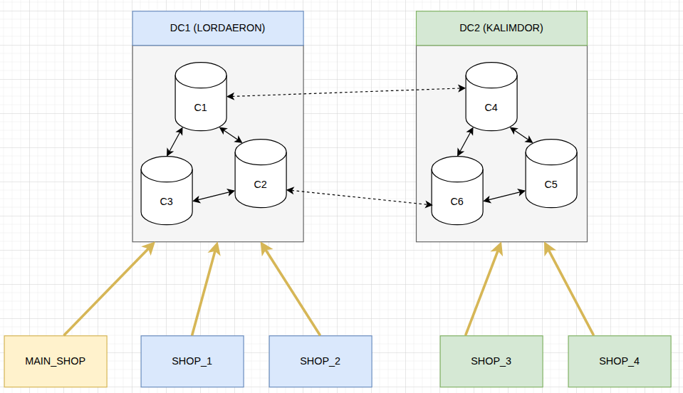
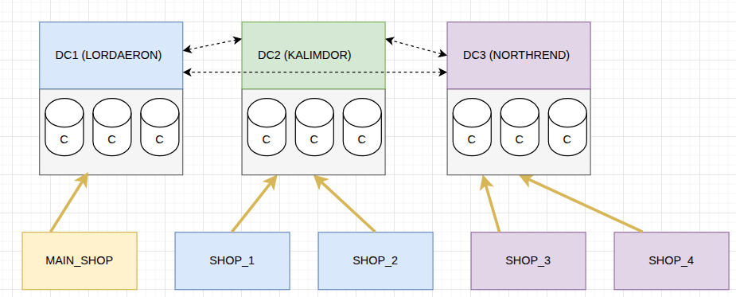

# About
Простой проект для демонстрации работы Cassandra и SpringBoot.

# Основная идея для реализации

Разработать систему хранения данных для децентрализованного магазина электроники "mobishop".
1) Магазин будет состоять из нескольких филиалов. 
2) Филиалы работаю от общего склада.
3) Товары в каталог заносятся централизованно из головного офиса и должны быть доступны всем филиалам, даже при кратковременной потере связи с головным офисом
4) Результатом продажи товаров являются списание остатков с общего склада и сохранение чека оплаты.
   * Списание с из общего склада должны быть согласованно с другими филиалами. Требуется поддерживать работу по списанию даже при потере головного офиса.
   * Ведение чеков должно производиться непосредственно в филиале продажи. При наличии связи филиалы должны иметь возможность обмениваться информацией о имеющихся чеках.

# Архитектурная схема системы хранения данных

## Схема на 2 ЦОД

## Схема на 3 ЦОД

# API : сущности, методы и семантика уровней согласования

##  Catalog

Товары для продажи в каталоге.
Используются всем магазинами. Изменения вносятся администратором централизованно (без конкуренции).

* GET catalog/list - получить каталог товаров
* GET catalog/get/0001-2011  - Получить описание товара из каталога
* POST catalog/add - добавить товар в каталог

Добавление должно быть видно во всех DC (EachQuorum), чтение только из локального DC (LocalQuorum)

## Balance

Баланс на складе.
Используются всем магазинами. Изменения вносятся всем магазинами (есть конкуренция).

* GET balance/list получить весь баланс склада
* GET balance/get/0001-2011  - получить баланс одного товара
* POST balance/change внести изменение баланса

Добавление в весь кластер с блокировкой (LWT Quorum), чтение из всего кластера (Quorum)

## Receipt

Чеки.
Каждый магазин работает только со своими чеками. Изменения вносятся только в свои магазин (без конкуренции).

* GET receipt/list - получить все чеки
* GET receipt/list/711/2025-01-01?after=10:11:00&limit=999 - получить все чеки на указанный магазин и день, после указанно времени
* POST receipt/add - Внести чеки

Добавление и чтение только в локальный DC (LocalQuorum), чтобы не нагружать остальные DC.
